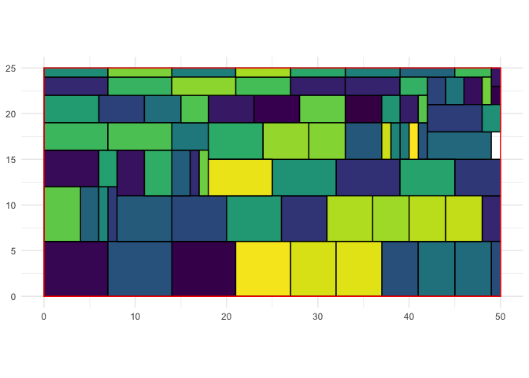
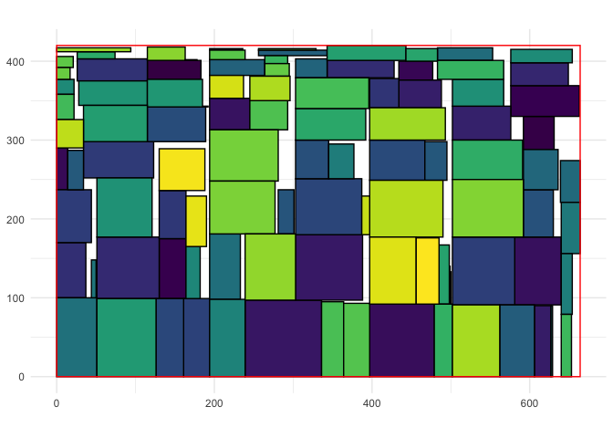

<!-- README.md is generated from README.Rmd. Please edit that file -->

# rectpacker

<!-- badges: start -->


[](https://CRAN.R-project.org/package=rectpacker)
<!-- badges: end -->

‘rectpacker’ implements the skyline algorithm for packing rectangles
into a box.

I wrote this package as I needed to assemble graphical assets into a
single image - hopefully minimising the size of the final image.

This package uses `stb_rect_pack.h` from
[stb](https://github.com/nothings/stb).

## Installation

<!-- This package can be installed from CRAN -->

<!-- ``` r -->

<!-- install.packages('rectpacker') -->

<!-- ``` -->

You can install the latest development version from
[GitHub](https://github.com/coolbutuseless/rectpacker) with:

``` r
# install.package('remotes')
remotes::install_github('coolbutuseless/rectpacker')
```

<!-- Pre-built source/binary versions can also be installed from -->

<!-- [R-universe](https://r-universe.dev) -->

<!-- ``` r -->

<!-- install.packages('rectpacker', repos = c('https://coolbutuseless.r-universe.dev', 'https://cloud.r-project.org')) -->

<!-- ``` -->

## Packing rectangles into a box

Pack 100 randomly sized rectangles into a 50x25 box.

Note that not all rectangles will fit into this box, but the algorithm
does the best it can. If a rectangle cannot fit, then `packed = FALSE`

``` r
library(ggplot2)
library(rectpacker)

set.seed(1)
N       <- 100
widths  <- sample(7, N, replace = TRUE)
heights <- sample(6, N, replace = TRUE)
rects   <- pack_rects(50, 25, widths, heights)

# How many of the 100 rectangles actually got packed?
table(rects$packed)
```

    #> 
    #> FALSE  TRUE 
    #>    18    82

``` r
# Keep only the rects which were able to be packed into the box
rects <- subset(rects, packed == TRUE)
head(rects)
```

    #> # A tibble: 6 × 6
    #>     idx     w     h packed     x     y
    #>   <int> <int> <int> <lgl>  <int> <int>
    #> 1     1     4     3 TRUE      33    19
    #> 2     2     7     6 TRUE      14     0
    #> 3     3     1     2 TRUE      49    21
    #> 4     5     5     3 TRUE      23    19
    #> 5     6     7     6 TRUE       0     0
    #> 6     8     6     4 TRUE       0    12

``` r
# Plot the rectangles
ggplot(rects) +
  geom_rect(
    aes(
      xmin = x,
      ymin = y,
      xmax = x + w,
      ymax = y + h,
      fill = as.factor(idx)
    ),
    col  = 'black'
  ) + 
  annotate('rect', xmin = 0, ymin = 0, xmax = 50, ymax = 25, fill = NA, col = 'red') + 
  coord_equal() + 
  theme_minimal() + 
  theme(legend.position = 'none') + 
  scale_fill_viridis_d()
```



## Finding a good box size to pack rectangles into

Often it is necessary to find the size of a box which will fit all
rectangles without too much wasted space.

`calc_small_box()` performs a brute force search for a suitable box
within the set of boxes of a given aspect ratio.

Note: This search is not guaranteed to find the absolute minimal box
size.

``` r
set.seed(1)
N <- 100
rect_widths  <- sample(N, N, T)
rect_heights <- sample(N, N, T)
box <- calc_small_box(rect_widths, rect_heights)
box
```

    #> $width
    #> [1] 664
    #> 
    #> $height
    #> [1] 420

``` r
rects <- pack_rects(box$width, box$height, rect_widths, rect_heights)

ggplot(rects) +
  geom_rect(
    aes(
      xmin = x,
      ymin = y,
      xmax = x + w,
      ymax = y + h,
      fill = as.factor(idx)
    ),
    col  = 'black'
  ) + 
  annotate('rect', xmin = 0, ymin = 0, xmax = box$width, ymax = box$height, fill = NA, col = 'red') + 
  coord_equal() + 
  theme_minimal() + 
  theme(legend.position = 'none') + 
  scale_fill_viridis_d(option = 'D')
```


